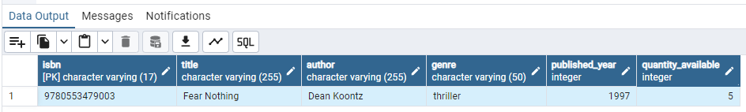
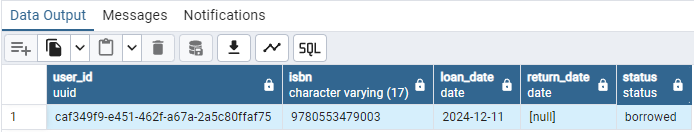

## SE 2141 LAB 4
> Online Library Management System Database Design <br>
> Suoberon, Jose Arron Franz I.

## Table of Contents

- [Conceptual Design](#conceptual-design)
- [Logical Design](#logical-design)
- [SQL Queries](#sql-queries)
- [Data Integrity and Optimization](#data-integrity-and-optimization)
- [Reflection](#reflection)


## Conceptual Design

<b>Entity-Relationship (ER) Diagram</b> for the system based on the given
requirements


## Logical Design

[Table Schemas](schema.sql)

```sql
CREATE EXTENSION IF NOT EXISTS "uuid-ossp";

CREATE TABLE users (
    user_id UUID PRIMARY KEY DEFAULT uuid_generate_v4(),
    full_name VARCHAR(255) NOT NULL,
    email VARCHAR(128) UNIQUE NOT NULL,
    membership_date DATE NOT NULL
  );
 
CREATE TABLE books (
	isbn VARCHAR(17) PRIMARY KEY NOT NULL,
    title VARCHAR(255) NOT NULL,
    author VARCHAR(255) NOT NULL,
    genre VARCHAR(50),
    published_year INT,
    quantity_available INT NOT NULL
  );

CREATE TYPE STATUS AS ENUM('borrowed', 'returned', 'overdue');
CREATE TABLE book_loans (
    user_id UUID REFERENCES users (user_id) ON DELETE CASCADE NOT NULL,
    isbn VARCHAR(17) REFERENCES books (isbn) ON DELETE CASCADE NOT NULL,
    loan_date DATE NOT NULL,
    return_date DATE,
    status STATUS NOT NULL
  );
```

## SQL Queries
1. Insert a new book into the library with a quantity of 5.

[Query 1](queries/1_output.sql)
```sql
INSERT INTO books (title, author, isbn, genre, published_year, quantity_available) 
VALUES ('Fear Nothing', 'Dean Koontz', '9780553479003', 'thriller', 1997, 5)
RETURNING *;
```


2. Add a new user to the system.

[Query 2](queries/2_output.sql)
```sql
INSERT INTO users (full_name, email, membership_date) 
VALUES ('Shishh', 'wooaah@gmail.com', CURRENT_DATE)
RETURNING *;
```


3. Record a book loan for a user.

[Query 3](queries/3_output.sql)
```sql
DO $$
DECLARE
    p_user_id UUID = 'caf349f9-e451-462f-a67a-2a5c80ffaf75';
    p_isbn VARCHAR(17) = '9780553479003';
    available_count INT;
BEGIN
    SELECT quantity_available INTO available_count 
    FROM books 
    WHERE isbn = p_isbn;

    --check for possible errors
    IF available_count IS NULL THEN
        RAISE EXCEPTION 'Book not found.';
    ELSIF available_count <= 0 THEN
        RAISE EXCEPTION 'Sorry. There are no copies left for this book.';
    END IF;

   --insert to book loans table
    INSERT INTO book_loans (user_id, isbn, loan_date, status) 
    VALUES (p_user_id, p_isbn, CURRENT_DATE, 'borrowed');

    --update qty
    UPDATE books 
    SET quantity_available = quantity_available - 1 
    WHERE isbn = p_isbn;

END $$;
```


4. Find all books borrowed by a specific user.

[Query 4](queries/4_output.sql)
```sql
SELECT b.title, bl.loan_date, bl.status
FROM books b 
JOIN book_loans bl ON b.isbn = bl.isbn 
WHERE bl.user_id = 'caf349f9-e451-462f-a67a-2a5c80ffaf75';
```


5. List all overdue loans.

[Query 5](queries/5_output.sql)
```sql
SELECT * FROM book_loans
WHERE status = 'overdue';
```


## Data Integrity and Optimization


## Reflection


